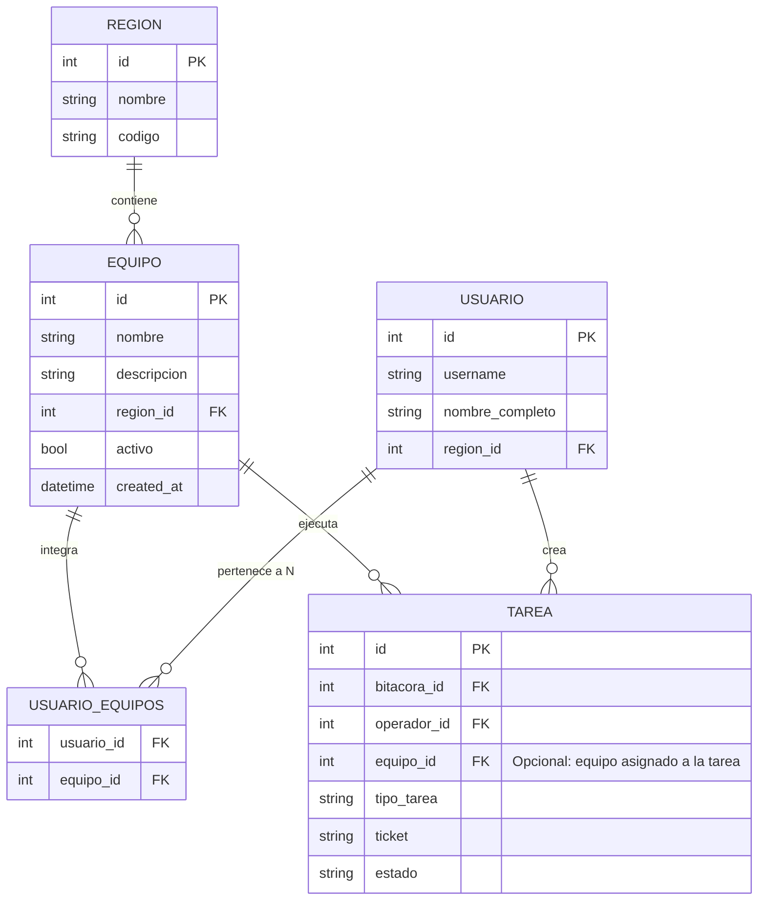

# Plan de Implementación y Arquitectura — Bitácora Diaria DOC

Documento de arquitectura técnica, módulos implementados y especificación de diseño para nuevas funcionalidades.

---

## 1. Módulos Implementados

### A. Exclusión en Tiempo Real en Dashboards de TV
- **Credenciales Especiales:** La API `/api/tv/<region_id>/credenciales` evalúa en tiempo real contra `datetime.utcnow()` y excluye automáticamente todas aquellas cuya fecha/hora de finalización ya expiró (`estado_vigencia == 'finalizada'`). Únicamente se proyectan credenciales *Vigentes Ahora* o *Programadas para hoy*.
- **Agenda de Tareas Planificadas:** La API `/api/tv/<region_id>/planificadas` evalúa contra `datetime.utcnow()` y descarta automáticamente las tareas cuya fecha de fin ya fue superada (`estado_tiempo == 'pasada'`). Solo se proyectan actividades *En Curso* y *Próximas*.

### B. Gestión y CRUD Completo de Usuarios & Permisos
- **Acceso Regional para Sub-admin (`sub_admin`):**
  - Los supervisores acceden a `/admin` (vía menú *Supervisión DOC > Gestión de Usuarios*).
  - Solo pueden visualizar, crear, editar y eliminar operadores y sub-admins pertenecientes a su propia sede (`region_id`).
  - No pueden ver administradores globales ni usuarios de otras regiones.
  - No pueden elevar usuarios al rol de `admin` global ni transferir usuarios a otras regiones.
- **Acceso Global para Administrador (`admin`):**
  - Control total sobre todas las sedes, asignación libre de regiones y roles globales.
- **Modal de Edición Interactivo:**
  - Modificación de Nombre Completo, Email Corporativo, Rol, Región, Estado (Activo/Inactivo) y Reset de Contraseña.
  - Eliminación permanente de usuarios con confirmación de seguridad (bloqueando auto-eliminación de la cuenta en sesión).

---

## 2. Propuesta de Arquitectura: Módulo de Equipos por Sede y Métricas Segmentadas

> [!NOTE]
> Especificación técnica detallada para el módulo de **Equipos / Grupos de Trabajo por Datacenter** y **Segmentación de Métricas en Dashboard Principal**.

### A. Modelo de Datos Relacional



### B. Estructura de Tablas SQL (PostgreSQL & SQLite)

```sql
-- Tabla de Equipos por Región
CREATE TABLE IF NOT EXISTS equipos (
    id SERIAL PRIMARY KEY,
    nombre VARCHAR(100) NOT NULL,
    descripcion TEXT,
    region_id INTEGER NOT NULL REFERENCES regiones(id) ON DELETE CASCADE,
    activo BOOLEAN DEFAULT TRUE,
    created_at TIMESTAMP DEFAULT CURRENT_TIMESTAMP
);

-- Tabla intermedia Muchos a Muchos (Usuario <-> Equipos)
CREATE TABLE IF NOT EXISTS usuario_equipos (
    usuario_id INTEGER NOT NULL REFERENCES usuarios(id) ON DELETE CASCADE,
    equipo_id INTEGER NOT NULL REFERENCES equipos(id) ON DELETE CASCADE,
    PRIMARY KEY (usuario_id, equipo_id)
);

-- Columna opcional en Tareas para vincular tarea con un equipo específico
ALTER TABLE tareas ADD COLUMN IF NOT EXISTS equipo_id INTEGER REFERENCES equipos(id) ON DELETE SET NULL;
```

### C. Reglas de Negocio y Control de Acceso (RBAC)

1. **Creación de Equipos por Región:**
   - Cada **Sub-admin (Supervisor DOC)** puede crear, editar y archivar equipos **exclusivamente dentro de su región** (Ej: *Chile:* "Equipo Virtualización", "Equipo Manos Remotas"; *Argentina:* "Equipo Manos Inteligentes", "Equipo Backups").
   - El **Admin Global** puede crear y administrar equipos en cualquiera de las regiones registradas.
2. **Asignación Multiequipo de Operadores:**
   - Un operador puede pertenecer a **0, 1 o múltiples equipos** dentro de su misma sede.
   - En [`/perfil`](file:///c:/Users/Tomas/Desktop/Code/Bitacora%20Centro%20Operaciones/App/Templates/perfil.html), cada operador visualiza insignias con los nombres de todos los equipos a los que pertenece.
3. **Métricas y Pestañas Dinámicas en Dashboard Principal ([`/dashboard`](file:///c:/Users/Tomas/Desktop/Code/Bitacora%20Centro%20Operaciones/App/Templates/dashboard.html)):**
   - El backend consulta los equipos activos de la región del usuario logueado.
   - En la cabecera de métricas del dashboard se generan pestañas dinámicas:
     - `[ Toda la Sede (Consolidado) ]`
     - `[ Equipo Virtualización ]`
     - `[ Equipo Manos Remotas ]`
     - `[ ... (N pestañas dinámicas según los equipos creados) ]`
   - Al hacer clic en una pestaña, los KPIs (*Total Tareas, Completadas, En Progreso, Eficiencia %*), el gráfico de distribución y la tabla de actividades se recalculan en caliente filtrando las tareas ejecutadas por los operadores que integran dicho equipo (o tareas explícitamente asignadas al equipo).

### D. Endpoints de API Propuestos

- `GET /api/equipos`: Lista equipos de la región del usuario actual (con lista de operadores miembros).
- `POST /api/equipos`: Creación de equipo (valida pertenencia regional para sub_admin).
- `PUT /api/equipos/<id>`: Actualización de datos y reasignación de operadores miembros.
- `DELETE /api/equipos/<id>`: Eliminación/desactivación de equipo.
- `GET /api/dashboard/kpis?equipo_id=<id>`: Retorna métricas segmentadas exclusivamente para ese grupo de trabajo.
