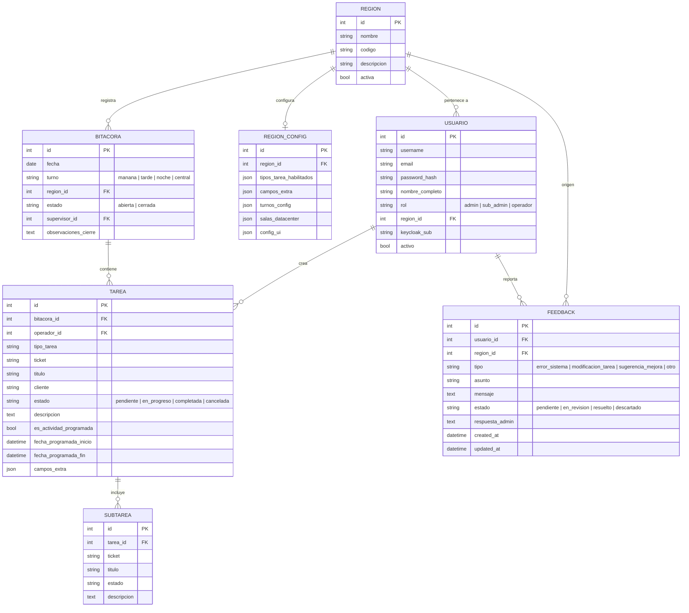

# Plan de Implementación — Bitácora Diaria DOC

Documento de arquitectura, decisiones técnicas y diseño del sistema web de bitácoras para operadores de Datacenter (DOC).

---

## 1. Arquitectura Técnica

- **Backend:** Python con Flask 3.0, SQLAlchemy 3.1 / 2.0 y Application Factory Pattern (`create_app`).
- **Base de Datos:** PostgreSQL con soporte DDL en `init_db.sql` y fallback local a SQLite en desarrollo con auto-migración de esquema al inicio.
- **Frontend:** HTML5, CSS3 moderno con variables CSS y diseño responsive oscuro/claro profesional de Datacenter, JavaScript Vanilla modular por vista.
- **Autenticación:** Sesiones de desarrollo seguras con Werkzeug (`generate_password_hash`), decorators `@login_required`, `@sub_admin_required`, `@admin_required` y soporte de claims para integración futura con **Keycloak** (`keycloak_sub`).

---

## 2. Modelo de Datos y Entidades

---

## 3. Tipos de Tareas Contempladas y Reglas de Negocio

1. **`manos_remotas`**: Tareas operativas de soporte físico.
2. **`manos_inteligentes`**: Soporte avanzado y configuraciones.
3. **`acceso_equipos`**: Programada por defecto, requiere `fecha_programada_inicio` (fin opcional) y `sala_datacenter`.
4. **`retiro_equipos`**: Programada por defecto, requiere `fecha_programada_inicio` (fin opcional) y `sala_datacenter`.
5. **`acceso_tecnicos`**: Programada por defecto, requiere `fecha_programada_inicio` (fin opcional), `sala_datacenter` y empresa.
6. **`restore`**: Tareas de restauración de backups/sistemas (no programada por defecto, campos reseteados al cambiar).
7. **`backup`**: Respaldos con soporte de subtareas (no programada por defecto).
8. **`snapshot`**: Instantáneas de máquinas virtuales y storage (no programada por defecto).
9. **`mantenimiento`**: Programada por defecto, requiere `fecha_programada_inicio` y `fecha_programada_fin` obligatorias + `sitio_mantenimiento` (Salas DC / Subestaciones).
10. **`nota_de_turno`**: Novedades y avisos para el pase de guardia.
11. **`tarea_extra`**: Tareas adicionales fuera de catálogo estándar.
12. **`virtualizacion`**: Creación/modificación de VMs o hipervisores.
13. **`incidente`**: Fallas o eventos no planificados.
14. **`manejo_sitio_externo`**: Requiere `sitio_externo` (ej: Chile, Miami) y `cantidad_contactos`.
15. **`alta_credencial_especial`**: Programada obligatoria por defecto (inicio y fin requeridos), oculta campo Título en UI y autogenera título descriptivo en backend. Requiere `ticket_cliente` y lista de múltiples credenciales asociadas (`persona_propietaria`, `codigo_alfanumerico`).

---

## 4. Estructura de Secciones del Reporte de Correo

El reporte generado en `/mail-preview` se estructura en:
1. Encabezado corporativo (Centro de Operaciones, Región, Turno, Fecha).
2. Notas de Turno y Novedades de Cierre (arriba).
3. Resumen Ejecutivo de Contadores (Total, Completadas, En Progreso, Pendientes, Programadas).
4. **Tabla 1:** Casos del Operador del Turno.
5. **Tabla 2:** Actividades Programadas (desglosando Equipos, Técnicos y Mantenimientos).
6. **Tabla 3:** Altas de Credenciales Especiales.
7. **Tabla 4:** Manejo de Sitios Externos.
8. **Tabla 5:** Tareas Extras Aplicadas.
